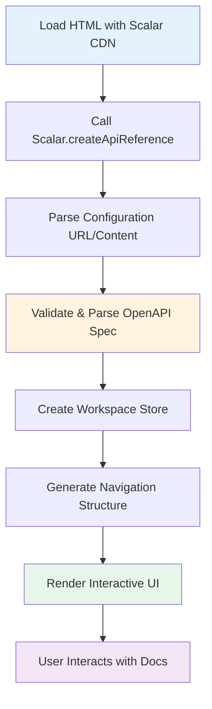
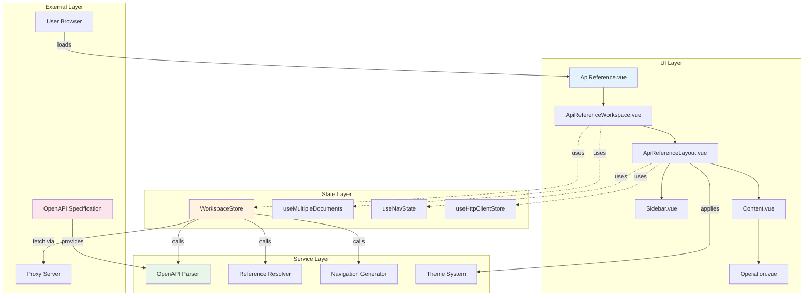
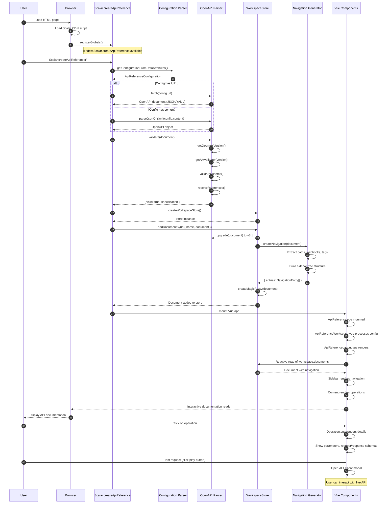

# Lifecycle: Generate Interactive API Documentation

## User Story
**As a** backend developer  
**I want to** transform my OpenAPI/Swagger specification into beautiful, interactive documentation  
**So that** API consumers can understand and test my API endpoints directly in the browser

---

## Layer 1: User Journey



---

## Layer 2: Component Architecture



### Component Implementation Map

| Component | Type | File Location | Line Range |
|-----------|------|---------------|------------|
| **UI Layer** |
| `ApiReference.vue` | Vue Component | `packages/api-reference/src/components/ApiReference.vue` | 1-27 |
| `ApiReferenceWorkspace.vue` | Vue Component | `packages/api-reference/src/v2/ApiReferenceWorkspace.vue` | 1-285 |
| `ApiReferenceLayout.vue` | Vue Component | `packages/api-reference/src/components/ApiReferenceLayout.vue` | 1-729 |
| `Sidebar.vue` | Vue Component | `packages/api-reference/src/features/sidebar/components/Sidebar.vue` | 1-256 |
| `Operation.vue` | Vue Component | `packages/api-reference/src/features/Operation/Operation.vue` | 1-118 |
| `ModernLayout.vue` | Vue Component | `packages/api-reference/src/features/Operation/layouts/ModernLayout.vue` | 1-203 |
| `ClassicLayout.vue` | Vue Component | `packages/api-reference/src/features/Operation/layouts/ClassicLayout.vue` | 1-389 |
| **State Layer** |
| `createWorkspaceStore` | Function | `packages/workspace-store/src/client.ts` | 114-332 |
| `useMultipleDocuments` | Composable | `packages/api-reference/src/features/multiple-documents/useMultipleDocuments.ts` | Full file |
| `useNavState` | Composable | `packages/api-reference/src/hooks/useNavState.ts` | Full file |
| `useSidebar` | Composable | `packages/api-reference/src/features/sidebar/hooks/useSidebar.ts` | Full file |
| **Service Layer** |
| `validate` | Function | `packages/openapi-parser/src/utils/validate.ts` | 12-26 |
| `Validator` | Class | `packages/openapi-parser/src/lib/Validator/Validator.ts` | 19-160 |
| `resolveReferences` | Function | `packages/openapi-parser/src/utils/resolve-references.ts` | 38-86 |
| `createNavigation` | Function | `packages/workspace-store/src/server.ts` | 286 |
| **Entry Points** |
| `createApiReference` | Function | `packages/api-reference/src/standalone/lib/html-api.ts` | 150-298 |
| `registerGlobals` | Function | `packages/api-reference/src/standalone/lib/register-globals.ts` | 14-23 |

---

## Layer 3: Detailed Sequence Diagram



### Key Design Patterns

1. **Provider/Injection Pattern (Vue Composition API)**
   - `ApiReferenceWorkspace.vue` creates the `WorkspaceStore` and provides it via Vue's provide/inject
   - Child components inject the store using `useWorkspace()` composable
   - Enables decoupled state management across component tree
   - Location: `packages/api-reference/src/v2/ApiReferenceWorkspace.vue:104`

2. **Proxy Pattern (Reactive State)**
   - `createMagicProxy()` wraps OpenAPI documents in ES6 Proxies
   - Enables lazy loading of external references via `$ref`
   - Provides reactivity for deeply nested document properties
   - Location: `packages/workspace-store/src/client.ts:156`

3. **Strategy Pattern (Document Loading)**
   - Multiple strategies for loading OpenAPI specs: URL fetch, inline content, or external filesystem
   - `addDocument()` vs `addDocumentSync()` methods handle async vs sync loading
   - Supports SSR and CSR with different chunking strategies
   - Location: `packages/api-reference/src/v2/ApiReferenceWorkspace.vue:120-148`

---

## Data Structures

```typescript
/**
 * Main configuration for the API Reference.
 * Supports multiple source formats and customization options.
 */
type ApiReferenceConfiguration = {
  /** OpenAPI specification source */
  url?: string
  content?: string | Record<string, unknown>
  
  /** Proxy server to avoid CORS issues */
  proxyUrl?: string
  
  /** Theme and styling */
  theme?: ThemeId
  darkMode?: boolean
  customCss?: string
  
  /** Layout options */
  layout?: 'modern' | 'classic'
  showSidebar?: boolean
  hideModels?: boolean
  hideDownloadButton?: boolean
  hideTestRequestButton?: boolean
  
  /** Authentication configuration */
  authentication?: AuthenticationConfiguration
  
  /** Server selection */
  servers?: Server[]
  defaultHttpClient?: HttpClientConfig
  
  /** Metadata for SEO */
  metaData?: Record<string, string>
  favicon?: string
}

/**
 * Specification configuration for a single document source.
 * Used when working with multiple API documents.
 */
type SpecConfiguration = {
  /** Friendly title for the document (optional, fallback to info.title) */
  title?: string
  
  /** Unique slug identifier (optional, auto-generated from title or index) */
  slug?: string
  
  /** URL to fetch the OpenAPI document from */
  url?: string
  
  /** Inline OpenAPI document content (JSON or YAML string, or parsed object) */
  content?: string | Record<string, unknown>
}

/**
 * Multi-source configuration that supports multiple API documents.
 * Enables unified documentation portals with multiple APIs.
 */
type ApiReferenceConfigurationWithSources = Omit<ApiReferenceConfiguration, 'url' | 'content'> & {
  /** Array of document sources to display */
  sources: (SpecConfiguration & { default?: boolean })[]
}

/**
 * The workspace store manages all OpenAPI documents and their state.
 * Provides reactive access to documents with lazy-loaded references.
 */
type WorkspaceStore = {
  /** Reactive workspace object containing all documents */
  workspace: {
    /** Map of document name to OpenAPI document */
    documents: Record<string, OpenAPIDocument>
    
    /** Currently active document name */
    'x-scalar-active-document'?: string
    
    /** Dark mode preference */
    'x-scalar-dark-mode'?: boolean
    
    /** Convenience getter for active document */
    activeDocument: OpenAPIDocument | undefined
  }
  
  /** Add a document from an object literal (synchronous) */
  addDocumentSync: (input: ObjectDoc) => void
  
  /** Add a document from a URL (asynchronous, returns Promise) */
  addDocument: (input: UrlDoc) => Promise<void>
  
  /** Update global workspace metadata */
  update: (key: string, value: unknown) => void
  
  /** Update specific document metadata */
  updateDocument: (documentName: string, key: string, value: unknown) => void
  
  /** Resolve and load document chunks including $ref references */
  resolve: (path: string[]) => Promise<void>
}

/**
 * OpenAPI document structure after parsing and upgrade to v3.1.
 * Contains the full API specification with navigation metadata.
 */
type OpenAPIDocument = {
  openapi: string // "3.1.0"
  info: {
    title: string
    version: string
    description?: string
    contact?: ContactObject
    license?: LicenseObject
  }
  
  /** API endpoints grouped by path */
  paths?: Record<string, PathItemObject>
  
  /** Webhook endpoints */
  webhooks?: Record<string, PathItemObject>
  
  /** Reusable components (schemas, parameters, responses, etc.) */
  components?: ComponentsObject
  
  /** Available servers for API calls */
  servers?: ServerObject[]
  
  /** Security schemes */
  security?: SecurityRequirementObject[]
  
  /** API tags for grouping operations */
  tags?: TagObject[]
  
  /** Scalar-specific extension: Generated navigation tree for sidebar */
  'x-scalar-navigation'?: NavigationEntry[]
}

/**
 * Navigation entry used in the sidebar.
 * Represents a single item in the navigation tree (tag, operation, heading, etc.)
 */
type NavigationEntry = {
  /** Unique identifier (used for routing and intersection observer) */
  id: string
  
  /** Display title */
  title: string
  
  /** Type of navigation entry */
  type: 'tag' | 'operation' | 'webhook' | 'heading' | 'model'
  
  /** HTTP method (for operations only) */
  method?: 'get' | 'post' | 'put' | 'delete' | 'patch' | 'options' | 'head'
  
  /** API path (for operations only) */
  path?: string
  
  /** Nested children entries */
  children?: NavigationEntry[]
  
  /** Whether the entry is deprecated */
  deprecated?: boolean
}

/**
 * Validation result from the OpenAPI Parser.
 * Contains parsed document and any validation errors.
 */
type ValidateResult = {
  /** Whether the document is valid according to OpenAPI spec */
  valid: boolean
  
  /** Array of validation errors (empty if valid) */
  errors: ErrorObject[]
  
  /** Parsed and validated OpenAPI document */
  specification?: OpenAPI.Document
  
  /** Detected OpenAPI version */
  version?: '2.0' | '3.0' | '3.1'
  
  /** Resolved schema with all $ref pointers dereferenced */
  schema?: OpenAPI.Document
}

/**
 * Operation object representing a single API endpoint.
 * Extracted from OpenAPI paths or webhooks.
 */
type OperationObject = {
  /** Operation identifier (must be unique) */
  operationId?: string
  
  /** Short summary of the operation */
  summary?: string
  
  /** Detailed description (supports Markdown) */
  description?: string
  
  /** Tags for API documentation grouping */
  tags?: string[]
  
  /** Parameters (path, query, header, cookie) */
  parameters?: ParameterObject[]
  
  /** Request body for POST/PUT/PATCH operations */
  requestBody?: RequestBodyObject
  
  /** Possible responses (status codes) */
  responses: Record<string, ResponseObject>
  
  /** Security requirements for this operation */
  security?: SecurityRequirementObject[]
  
  /** Servers specific to this operation */
  servers?: ServerObject[]
  
  /** Whether the operation is deprecated */
  deprecated?: boolean
  
  /** Callbacks for asynchronous operations */
  callbacks?: Record<string, CallbackObject>
}
```

---

## Quick Reference

### Event Triggers
- **Page Load**: Automatically initializes when `<script id="api-reference">` is detected
- **Manual Init**: `Scalar.createApiReference('#app', config)` call
- **Config Update**: `updateConfig(newConfig, mergeConfigs?)` method
- **Spec Update**: `updateSpec(spec)` method for live spec updates
- **Navigation**: Hash changes trigger sidebar scrolling via Intersection Observer
- **Dark Mode Toggle**: `scalar-update-dark-mode` custom event

### Supported Formats
- **OpenAPI Versions**: 3.1, 3.0, Swagger 2.0 (auto-upgraded)
- **Content Types**: JSON, YAML, JavaScript Object
- **Loading Methods**: URL fetch, inline content, data attributes
- **Proxy Support**: Built-in proxy for CORS issues (`proxyUrl` config)

### Error Handling
- **Invalid Spec**: Shows validation errors with specific line numbers
- **Missing Content**: Falls back to empty specification with warning
- **Network Errors**: Retry mechanism for URL fetching via proxy
- **Reference Errors**: Graceful degradation when `$ref` cannot be resolved
- **Component Errors**: `ScalarErrorBoundary` prevents crashes, logs to console

### Performance Optimizations
- **Lazy Loading**: Operations and schemas loaded on-demand via proxies
- **Virtual Scrolling**: Sidebar uses Intersection Observer for large APIs
- **Chunked Rendering**: SSR mode splits document into smaller chunks
- **Code Splitting**: Vue components loaded asynchronously
- **Memoization**: Computed properties cache expensive operations

### Key Files for Debugging
- Entry Point: `packages/api-reference/src/standalone.ts`
- Global Registration: `packages/api-reference/src/standalone/lib/register-globals.ts`
- Config Parser: `packages/api-reference/src/standalone/lib/html-api.ts`
- OpenAPI Validation: `packages/openapi-parser/src/lib/Validator/Validator.ts`
- Workspace Store: `packages/workspace-store/src/client.ts`
- Main Layout: `packages/api-reference/src/components/ApiReferenceLayout.vue`

---

## Component Overview

### Core Components

1. **ApiReference.vue** (`packages/api-reference/src/components/ApiReference.vue`)
   - Role: Top-level wrapper component
   - Responsibilities: Initialize workspace store, pass configuration to workspace
   - Props: `configuration` (single or multiple documents)

2. **ApiReferenceWorkspace.vue** (`packages/api-reference/src/v2/ApiReferenceWorkspace.vue`)
   - Role: State management layer
   - Responsibilities: Load documents, manage multiple sources, handle dark mode, proxy requests
   - Provides: WorkspaceStore, navigation state, custom event handlers

3. **ApiReferenceLayout.vue** (`packages/api-reference/src/components/ApiReferenceLayout.vue`)
   - Role: Main layout orchestrator
   - Responsibilities: Theme application, sidebar/content split, responsive design, plugin system
   - Features: Mobile header, classic header, search, API client modal, toasts

4. **Sidebar.vue** (`packages/api-reference/src/features/sidebar/components/Sidebar.vue`)
   - Role: Navigation sidebar
   - Responsibilities: Render navigation tree, scroll tracking, active item highlighting
   - Uses: Intersection Observer for automatic scrolling

5. **Operation.vue** (`packages/api-reference/src/features/Operation/Operation.vue`)
   - Role: Single API operation display
   - Responsibilities: Render endpoint details, parameters, request/response examples
   - Layouts: Modern or Classic layout variants

6. **Content.vue** (`packages/api-reference/src/components/Content/Content.vue`)
   - Role: Main content area
   - Responsibilities: Render introduction, tags, operations, models based on navigation

### Key Services

1. **OpenAPI Parser** (`packages/openapi-parser`)
   - Role: Parse and validate OpenAPI documents
   - Features: Multi-version support, reference resolution, schema validation, upgrade path

2. **Workspace Store** (`packages/workspace-store`)
   - Role: Centralized state management for documents
   - Features: Reactive proxies, lazy loading, multi-document support, SSR chunking

3. **Navigation Generator** (`packages/workspace-store/src/server.ts`)
   - Role: Generate sidebar navigation structure
   - Output: Hierarchical tree of tags, operations, webhooks, models

4. **Theme System** (`packages/themes`)
   - Role: Apply visual themes and dark mode
   - Features: CSS custom properties, pre-built themes, customization API

---

## Related Lifecycles

### 1. **Test and Debug APIs (API Client)**
   - **Connection**: Uses same OpenAPI parsing and workspace store
   - **File**: `packages/api-client/src/App.vue`
   - **Trigger**: Clicking "Test Request" button opens API client modal
   - **Related Components**: `ApiClientModal.vue`, `TestRequestButton.vue`

### 2. **Parse and Validate OpenAPI Documents**
   - **Connection**: Core dependency of documentation generation
   - **File**: `packages/openapi-parser/src/utils/validate.ts`
   - **Key Functions**: `validate()`, `resolveReferences()`, `upgrade()`
   - **Used By**: WorkspaceStore during document addition

### 3. **Generate Code Snippets**
   - **Connection**: Displayed in operation examples
   - **File**: `packages/snippetz/src/httpsnippet-lite/index.ts`
   - **Related Component**: `ExampleRequest.vue` renders code snippets
   - **Languages**: 25+ supported languages via `@scalar/snippetz`

### 4. **Multi-Document API Hub**
   - **Connection**: Extends single-document flow with source selection
   - **File**: `packages/api-reference/src/features/multiple-documents/useMultipleDocuments.ts`
   - **Related Component**: `DocumentSelector.vue` for switching between APIs
   - **Feature**: Unified navigation across multiple OpenAPI specs

### 5. **Framework Integration (Express, Fastify, NestJS, etc.)**
   - **Connection**: Server-side rendering of API Reference
   - **Files**: `integrations/express/`, `integrations/fastify/`, etc.
   - **Entry Point**: Each framework uses `ApiReference` component or standalone bundle
   - **SSR Support**: Pre-renders HTML for faster initial page load

