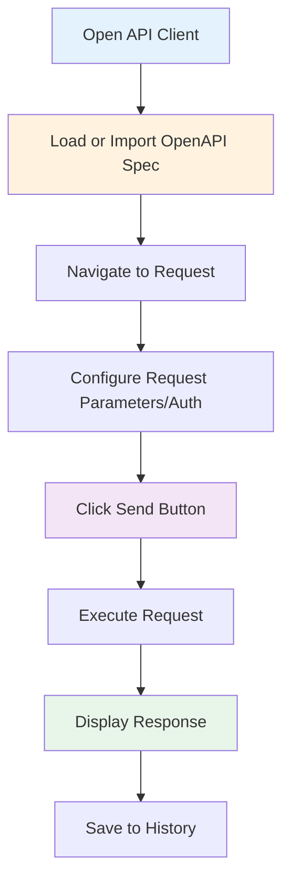
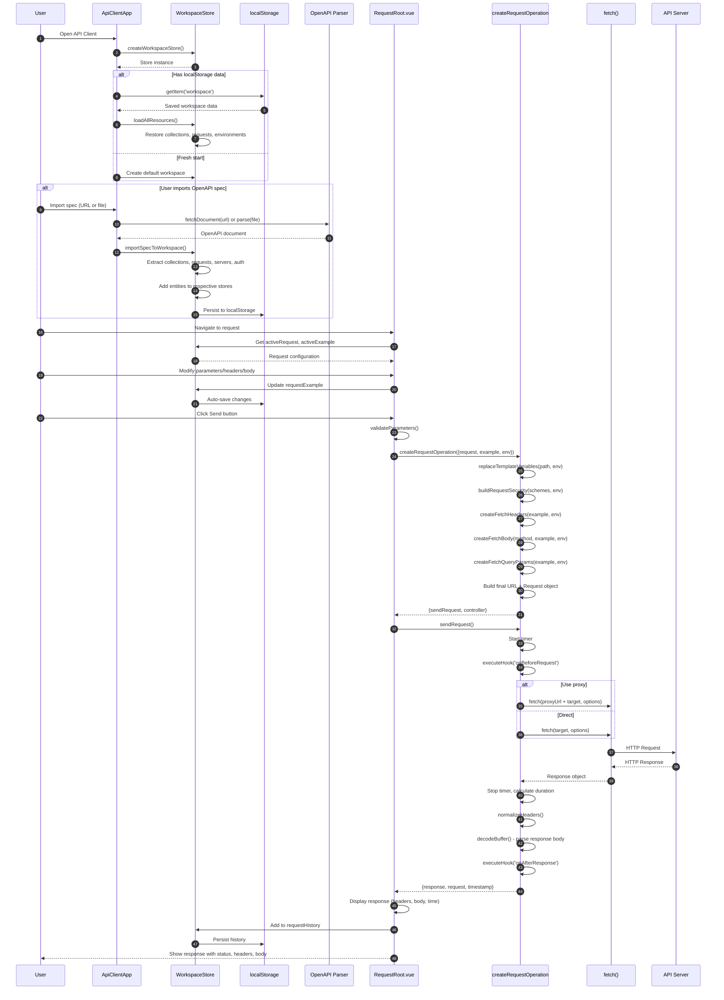

# Lifecycle: Test and Debug APIs (API Client)

## User Story
**As a** frontend developer or QA engineer  
**I want to** send API requests, inspect responses, and debug API interactions  
**So that** I can test endpoints and troubleshoot integration issues without using Postman

---

## Layer 1: User Journey



---

## Layer 2: Component Architecture

```mermaid
graph TB
    subgraph UILayer[UI Layer]
        UI1[ApiClientApp.vue]
        UI2[RequestRoot.vue]
        UI3[Sidebar.vue]
        UI4[AddressBar.vue]
        UI5[RequestSection]
        UI6[ResponseSection]
        UI7[CommandPalette.vue]
    end
    
    subgraph StateLayer[State Layer - Workspace Store]
        S1[collections]
        S2[requests]
        S3[requestExamples]
        S4[environments]
        S5[servers]
        S6[securitySchemes]
        S7[workspaces]
        S8[cookies]
    end
    
    subgraph ServiceLayer[Service Layer]
        SV1[createRequestOperation]
        SV2[buildRequestSecurity]
        SV3[createFetchHeaders]
        SV4[createFetchBody]
        SV5[importSpecToWorkspace]
        SV6[localStorage Manager]
    end
    
    subgraph ExternalLayer[External Layer]
        E1[OpenAPI Spec]
        E2[API Server]
        E3[localStorage]
        E4[Proxy Server]
    end
    
    UI1 --> UI2
    UI2 --> UI3
    UI2 --> UI4
    UI2 --> UI5
    UI2 --> UI6
    UI1 --> UI7
    
    UI2 -.->|uses| S1
    UI2 -.->|uses| S2
    UI2 -.->|uses| S3
    UI2 -.->|uses| S4
    UI2 -.->|uses| S5
    UI2 -.->|uses| S6
    UI2 -.->|uses| S7
    UI2 -.->|uses| S8
    
    UI2 -->|calls| SV1
    SV1 -->|uses| SV2
    SV1 -->|uses| SV3
    SV1 -->|uses| SV4
    
    S1 -->|persist to| E3
    SV5 -->|imports from| E1
    SV1 -->|fetch via| E4
    SV1 -->|sends to| E2
    SV6 -->|reads/writes| E3
    
    style UI1 fill:#e3f2fd
    style S1 fill:#fff3e0
    style SV1 fill:#e8f5e9
    style E2 fill:#fce4ec
```



### Component Implementation Map

| Component | Type | File Location | Line Range |
|-----------|------|---------------|------------|
| **UI Layer** |
| `ApiClientApp.vue` | Vue Component | `packages/api-client/src/layouts/App/ApiClientApp.vue` | 1-150 |
| `ApiClientWeb.vue` | Vue Component | `packages/api-client/src/layouts/Web/ApiClientWeb.vue` | 1-100 |
| `ApiClientModal.vue` | Vue Component | `packages/api-client/src/layouts/Modal/ApiClientModal.vue` | 1-120 |
| `RequestRoot.vue` | Vue Component | `packages/api-client/src/views/Request/RequestRoot.vue` | 1-239 |
| `Sidebar.vue` | Vue Component | `packages/api-client/src/components/Sidebar/Sidebar.vue` | Full file |
| `AddressBar.vue` | Vue Component | `packages/api-client/src/components/AddressBar/AddressBar.vue` | Full file |
| `RequestSection/` | Vue Directory | `packages/api-client/src/views/Request/RequestSection/` | Multiple files |
| `ResponseSection/` | Vue Directory | `packages/api-client/src/views/Request/ResponseSection/` | Multiple files |
| `CommandPalette.vue` | Vue Component | `packages/api-client/src/components/CommandPalette/TheCommandPalette.vue` | Full file |
| **State Layer** |
| `createWorkspaceStore` | Function | `packages/api-client/src/store/store.ts` | 45-251 |
| `createStoreCollections` | Function | `packages/api-client/src/store/collections.ts` | Full file |
| `createStoreRequests` | Function | `packages/api-client/src/store/requests.ts` | Full file |
| `createStoreRequestExamples` | Function | `packages/api-client/src/store/request-example.ts` | Full file |
| `createStoreEnvironments` | Function | `packages/api-client/src/store/environment.ts` | Full file |
| `createStoreServers` | Function | `packages/api-client/src/store/servers.ts` | Full file |
| `createStoreSecuritySchemes` | Function | `packages/api-client/src/store/security-schemes.ts` | Full file |
| `createStoreWorkspaces` | Function | `packages/api-client/src/store/workspace.ts` | Full file |
| `createStoreCookies` | Function | `packages/api-client/src/store/cookies.ts` | Full file |
| `useActiveEntities` | Composable | `packages/api-client/src/store/active-entities.ts` | Full file |
| **Service Layer** |
| `createRequestOperation` | Function | `packages/api-client/src/libs/send-request/create-request-operation.ts` | 38-307 |
| `buildRequestSecurity` | Function | `packages/api-client/src/libs/send-request/build-request-security.ts` | 10-63 |
| `createFetchHeaders` | Function | `packages/api-client/src/libs/send-request/create-fetch-headers.ts` | Full file |
| `createFetchBody` | Function | `packages/api-client/src/libs/send-request/create-fetch-body.ts` | 11-58 |
| `createFetchQueryParams` | Function | `packages/api-client/src/libs/send-request/create-fetch-query-params.ts` | Full file |
| `importSpecToWorkspace` | Function | `packages/oas-utils/src/transforms/import-spec.ts` | Full file |
| `loadAllResources` | Function | `packages/api-client/src/libs/local-storage.ts` | 39-83 |
| **Entry Points** |
| `createApiClientApp` | Function | `packages/api-client/src/layouts/App/create-api-client-app.ts` | 9-44 |
| `createApiClient` | Function | `packages/api-client/src/libs/create-client.ts` | 83-244 |

---

## Layer 3: Detailed Sequence Diagram



### Key Design Patterns

1. **Reactive Store Pattern (Vue Reactivity + Entity Managers)**
   - Each entity type (requests, collections, servers) has its own reactive store
   - Mutators provide CRUD operations with automatic localStorage persistence
   - Changes propagate instantly to all UI components watching the store
   - Location: `packages/api-client/src/store/store.ts:45-251`

2. **Builder Pattern (Request Construction)**
   - `createRequestOperation` orchestrates building the final request
   - Separate builders for headers, body, query params, authentication
   - Each builder handles template variable substitution
   - Composes the final `fetch()` request incrementally
   - Location: `packages/api-client/src/libs/send-request/create-request-operation.ts:38-307`

3. **Plugin System (Middleware Hooks)**
   - `PluginManager` allows registering plugins for extensibility
   - Hooks: `onBeforeRequest`, `onAfterResponse`
   - Plugins can modify requests/responses or add custom behavior
   - Non-blocking execution with error boundaries
   - Location: `packages/api-client/src/plugins/plugin-manager.ts`

---

## Data Structures

```typescript
/**
 * The centralized store for the API client.
 * Manages all application state including workspaces, collections, requests, and environments.
 */
type WorkspaceStore = {
  /** Map of collection UID to collection object */
  collections: Record<string, Collection>
  
  /** Map of tag UID to tag object */
  tags: Record<string, Tag>
  
  /** Map of request UID to request object (operation definitions) */
  requests: Record<string, Operation>
  
  /** Map of request example UID to request example object (actual request data) */
  requestExamples: Record<string, RequestExample>
  
  /** Map of cookie UID to cookie object */
  cookies: Record<string, Cookie>
  
  /** Map of environment UID to environment object */
  environments: Record<string, Environment>
  
  /** Map of server UID to server object */
  servers: Record<string, Server>
  
  /** Map of security scheme UID to security scheme object */
  securitySchemes: Record<string, SecurityScheme>
  
  /** Map of workspace UID to workspace object */
  workspaces: Record<string, Workspace>
  
  /** History of executed requests with responses */
  requestHistory: RequestEvent[]
  
  /** Mutators for each entity type (add, edit, delete, reset) */
  collectionMutators: EntityMutators<Collection>
  tagMutators: EntityMutators<Tag>
  requestMutators: EntityMutators<Operation>
  requestExampleMutators: EntityMutators<RequestExample>
  cookieMutators: EntityMutators<Cookie>
  environmentMutators: EntityMutators<Environment>
  serverMutators: EntityMutators<Server>
  securitySchemeMutators: EntityMutators<SecurityScheme>
  workspaceMutators: EntityMutators<Workspace>
  
  /** Import functions */
  importSpecFile: (spec: string | object, workspaceUid: string) => Promise<void>
  importSpecFromUrl: (url: string, workspaceUid: string) => Promise<void>
  
  /** Event bus for application-wide events */
  events: EventBus
}

/**
 * Workspace represents a top-level container for organizing API collections.
 * Similar to Postman workspaces, it groups related collections together.
 */
type Workspace = {
  /** Unique identifier */
  uid: string
  
  /** Display name */
  name: string
  
  /** Array of collection UIDs in this workspace */
  collections: string[]
  
  /** Array of cookie UIDs available in this workspace */
  cookies: string[]
  
  /** Proxy URL for routing requests through CORS proxy */
  proxyUrl?: string
  
  /** Whether to use request cookies */
  isReadOnly?: boolean
  
  /** Theme ID for visual customization */
  themeId?: string
}

/**
 * Collection represents an API specification (imported from OpenAPI).
 * Maps to a single OpenAPI document.
 */
type Collection = {
  /** Unique identifier */
  uid: string
  
  /** Collection name (from OpenAPI info.title) */
  info: {
    title: string
    description?: string
    version?: string
  }
  
  /** Array of request UIDs in this collection */
  requests: string[]
  
  /** Array of server UIDs for this collection */
  servers?: string[]
  
  /** Array of security scheme UIDs */
  securitySchemes?: string[]
  
  /** Selected security scheme UIDs for collection-level auth */
  selectedSecuritySchemeUids?: string[]
  
  /** Whether to use collection-level security instead of per-request */
  useCollectionSecurity?: boolean
  
  /** Selected server UID for this collection */
  selectedServerUid?: string
  
  /** OpenAPI specification object */
  spec?: OpenAPIV3.Document | OpenAPIV3_1.Document
}

/**
 * Operation (Request) represents an API endpoint operation.
 * Extracted from OpenAPI paths.
 */
type Operation = {
  /** Unique identifier */
  uid: string
  
  /** Parent collection UID */
  collectionUid: string
  
  /** Display summary */
  summary?: string
  
  /** Detailed description */
  description?: string
  
  /** HTTP method */
  method: 'get' | 'post' | 'put' | 'delete' | 'patch' | 'options' | 'head'
  
  /** URL path (with path parameters like /users/{id}) */
  path: string
  
  /** Operation ID from OpenAPI */
  operationId?: string
  
  /** Array of request example UIDs for this operation */
  examples: string[]
  
  /** Array of tag UIDs for grouping */
  tags?: string[]
  
  /** Whether operation is deprecated */
  deprecated?: boolean
  
  /** Selected security scheme UIDs (if not using collection auth) */
  selectedSecuritySchemeUids?: string[]
  
  /** Selected server UID (if different from collection) */
  selectedServerUid?: string
  
  /** OpenAPI operation object */
  information?: OpenAPIV3.OperationObject | OpenAPIV3_1.OperationObject
}

/**
 * RequestExample represents the actual request data for an operation.
 * An operation can have multiple examples (like "success case", "error case").
 */
type RequestExample = {
  /** Unique identifier */
  uid: string
  
  /** Parent request UID */
  requestUid: string
  
  /** Example name */
  name?: string
  
  /** Path parameters */
  parameters: {
    path: Parameter[]
    query: Parameter[]
    headers: Parameter[]
    cookies: Parameter[]
  }
  
  /** Request body */
  body: {
    /** Whether body is active */
    activeBody: 'raw' | 'formData' | 'binary'
    
    /** Raw body content */
    raw: {
      encoding: string
      value: string
    }
    
    /** Form data fields */
    formData: {
      encoding: string
      value: FormDataItem[]
    }
    
    /** Binary file */
    binary?: File
  }
}

/**
 * Parameter represents a single request parameter (path, query, header, or cookie).
 */
type Parameter = {
  /** Parameter key/name */
  key: string
  
  /** Parameter value (supports template variables like {{baseUrl}}) */
  value: string
  
  /** Whether parameter is enabled (can be toggled off) */
  enabled: boolean
  
  /** Whether parameter is required (from OpenAPI spec) */
  required?: boolean
  
  /** Parameter description */
  description?: string
  
  /** File attachment (for multipart/form-data) */
  file?: File
  
  /** Parameter type (from OpenAPI schema) */
  type?: 'string' | 'number' | 'boolean' | 'array' | 'object'
}

/**
 * Server represents an API server endpoint.
 * Extracted from OpenAPI servers array.
 */
type Server = {
  /** Unique identifier */
  uid: string
  
  /** Server URL (can include variables like {protocol}://api.example.com) */
  url: string
  
  /** Server description */
  description?: string
  
  /** Server variables (for URL templating) */
  variables?: Record<string, {
    default: string
    description?: string
    enum?: string[]
  }>
}

/**
 * SecurityScheme represents an authentication method.
 * Extracted from OpenAPI security schemes.
 */
type SecurityScheme = {
  /** Unique identifier */
  uid: string
  
  /** Security scheme type */
  type: 'apiKey' | 'http' | 'oauth2' | 'openIdConnect'
  
  /** Scheme name in OpenAPI */
  nameKey: string
  
  /** For apiKey: where to send (header, query, cookie) */
  in?: 'header' | 'query' | 'cookie'
  
  /** For apiKey: parameter name */
  name?: string
  
  /** For apiKey: the actual API key value */
  value?: string
  
  /** For http: scheme type (basic, bearer, digest) */
  scheme?: 'basic' | 'bearer' | 'digest'
  
  /** For http bearer: the token value */
  token?: string
  
  /** For http basic: username */
  username?: string
  
  /** For http basic: password */
  password?: string
  
  /** For oauth2: flows configuration */
  flows?: {
    implicit?: OAuthFlow
    password?: OAuthFlow
    clientCredentials?: OAuthFlow
    authorizationCode?: OAuthFlow
  }
}

/**
 * Environment represents a set of variables for different contexts (dev, staging, prod).
 * Similar to Postman environments.
 */
type Environment = {
  /** Unique identifier */
  uid: string
  
  /** Environment name */
  name: string
  
  /** Variables as JSON string (e.g., '{"baseUrl": "https://api.dev.com"}') */
  value: string
  
  /** Whether this is the currently selected environment */
  isDefault?: boolean
}

/**
 * Cookie represents a browser cookie.
 * Can be sent with requests.
 */
type Cookie = {
  /** Unique identifier */
  uid: string
  
  /** Cookie name */
  name: string
  
  /** Cookie value */
  value: string
  
  /** Cookie domain */
  domain?: string
  
  /** Cookie path */
  path: string
  
  /** Whether cookie is secure */
  secure?: boolean
  
  /** Whether cookie is HTTP-only */
  httpOnly?: boolean
  
  /** Cookie expiration date */
  expires?: string
}

/**
 * RequestEvent represents a single request/response pair in the history.
 */
type RequestEvent = {
  /** Request object */
  request: RequestExample
  
  /** Response data */
  response: ResponseInstance
  
  /** Timestamp when request was sent */
  timestamp: number
  
  /** Request duration in milliseconds */
  duration: number
}

/**
 * ResponseInstance represents an API response.
 */
type ResponseInstance = {
  /** HTTP status code */
  status: number
  
  /** HTTP status text */
  statusText: string
  
  /** Response headers */
  headers: { name: string; value: string }[]
  
  /** Response body (parsed based on content-type) */
  data: string | object | Blob | ArrayBuffer
  
  /** Response size in bytes */
  size: number
}
```

---

## Quick Reference

### Event Triggers
- **App Launch**: Loads from localStorage if available, initializes default workspace if not
- **Import Spec**: Command palette (`Cmd+K`), Import button, or drag-and-drop OpenAPI file
- **Send Request**: Send button, `Cmd+Enter` hotkey, or address bar Enter
- **Cancel Request**: Stop button or `Esc` key (aborts fetch controller)
- **Auto-save**: All changes to request examples persist to localStorage immediately
- **History**: Each request execution adds entry to `requestHistory` array

### Supported Features
- **OpenAPI Import**: Swagger 2.0, OpenAPI 3.0, OpenAPI 3.1 (auto-parsed and converted)
- **Authentication**: API Key, Bearer Token, Basic Auth, OAuth 2.0, OpenID Connect
- **Request Bodies**: JSON, XML, Form Data, Multipart, Binary file upload
- **Template Variables**: Environment variables in URLs, headers, body (e.g., `{{baseUrl}}`)
- **Proxy Support**: Built-in CORS proxy via `proxyUrl` config
- **Offline-First**: Desktop app works without internet (except for remote API calls)
- **Watch Mode**: Auto-sync with local OpenAPI file changes

### Error Handling
- **Network Errors**: Shows toast notification with retry option
- **Invalid Parameters**: Highlights missing required parameters before sending
- **Parse Errors**: Displays parse error for invalid JSON/XML responses
- **Abort Errors**: Graceful cancellation without error toast
- **localStorage Quota**: Warns when storage limit reached, offers cleanup
- **CORS Errors**: Suggests using proxy URL if CORS preflight fails

### Performance Optimizations
- **Lazy Loading**: UI components loaded on-demand via Vue Router
- **Debounced Auto-save**: Batches localStorage writes to avoid blocking
- **Request Streaming**: Supports Server-Sent Events (text/event-stream)
- **Response Buffering**: Uses ArrayBuffer for efficient large response handling
- **Indexed Collections**: Fast lookups via UID-indexed reactive maps

### Key Files for Debugging
- Entry Point: `packages/api-client/src/layouts/App/create-api-client-app.ts`
- Store Factory: `packages/api-client/src/store/store.ts`
- Request Execution: `packages/api-client/src/views/Request/RequestRoot.vue:68-130`
- Request Builder: `packages/api-client/src/libs/send-request/create-request-operation.ts`
- localStorage Manager: `packages/api-client/src/libs/local-storage.ts`
- Import Logic: `packages/api-client/src/store/import-spec.ts`

---

## Component Overview

### Core Components

1. **ApiClientApp.vue** (`packages/api-client/src/layouts/App/ApiClientApp.vue`)
   - Role: Top-level app container
   - Responsibilities: Router outlet, command palette, sidebar toggle, workspace switcher
   - Layouts: Desktop app (full-featured), Web (embedded), Modal (compact)

2. **RequestRoot.vue** (`packages/api-client/src/views/Request/RequestRoot.vue`)
   - Role: Request execution orchestrator
   - Responsibilities: Send requests, handle responses, manage request history
   - Features: Parameter validation, abort controller, event handling

3. **Sidebar.vue** (`packages/api-client/src/components/Sidebar/Sidebar.vue`)
   - Role: Collection/request navigation
   - Responsibilities: Display collections, folders, requests in tree structure
   - Features: Drag-and-drop reordering, context menus, filtering

4. **AddressBar.vue** (`packages/api-client/src/components/AddressBar/AddressBar.vue`)
   - Role: URL editor and send button
   - Responsibilities: Display full URL with variables resolved, initiate requests
   - Features: Method selector, URL autocomplete, history dropdown

5. **RequestSection/** (`packages/api-client/src/views/Request/RequestSection/`)
   - Role: Request configuration tabs
   - Components: Parameters, Headers, Body, Auth, Scripts, Settings
   - Features: Data tables, CodeMirror editors, auth form builders

6. **ResponseSection/** (`packages/api-client/src/views/Request/ResponseSection/`)
   - Role: Response display tabs
   - Components: Body viewer, Headers table, Cookies, Timeline, Test results
   - Features: Syntax highlighting, JSON/XML formatters, image preview

7. **CommandPalette.vue** (`packages/api-client/src/components/CommandPalette/TheCommandPalette.vue`)
   - Role: Quick actions menu (Cmd+K)
   - Responsibilities: Search requests, switch collections, import specs, settings
   - Features: Fuzzy search, keyboard navigation, recent items

### Key Services

1. **WorkspaceStore** (`packages/api-client/src/store/store.ts`)
   - Role: Centralized reactive state management
   - Features: Entity stores, mutators, localStorage sync, event bus

2. **createRequestOperation** (`packages/api-client/src/libs/send-request/create-request-operation.ts`)
   - Role: Build and execute HTTP requests
   - Features: Template variable substitution, security injection, proxy support

3. **importSpecToWorkspace** (`packages/oas-utils/src/transforms/import-spec.ts`)
   - Role: Parse OpenAPI and generate workspace entities
   - Features: Multi-version support, reference resolution, validation

4. **loadAllResources** (`packages/api-client/src/libs/local-storage.ts`)
   - Role: Restore workspace from localStorage
   - Features: Migration system, schema validation, error recovery

---

## Related Lifecycles

### 1. **Generate Interactive API Documentation**
   - **Connection**: Shares OpenAPI parser and workspace store
   - **File**: `packages/api-reference/src/components/ApiReference.vue`
   - **Trigger**: API Reference "Test Request" button opens API Client modal
   - **Shared Components**: OpenAPI parser, snippetz (code generation), themes

### 2. **Parse and Validate OpenAPI Documents**
   - **Connection**: Core dependency for spec imports
   - **File**: `packages/openapi-parser/src/utils/validate.ts`
   - **Key Functions**: `validate()`, `upgrade()`, `dereference()`
   - **Used By**: `importSpecFile()` during OpenAPI import

### 3. **Generate Code Snippets**
   - **Connection**: Code snippet tab in API client
   - **File**: `packages/snippetz/src/httpsnippet-lite/index.ts`
   - **Related Component**: `CodeSnippet.vue` displays generated code
   - **Languages**: cURL, JavaScript, Python, PHP, Go, etc.

### 4. **Mock APIs for Development**
   - **Connection**: Mock server can serve as target for API client
   - **File**: `packages/mock-server/src/server.ts`
   - **Use Case**: Test frontend with mock responses before backend is ready
   - **Integration**: Point API client server URL to mock server

### 5. **Postman Collection Import**
   - **Connection**: Converts Postman collections to API client format
   - **File**: `packages/postman-to-openapi/src/index.ts`
   - **Entry Point**: Import button in command palette
   - **Migration**: Preserves requests, folders, auth, environments

