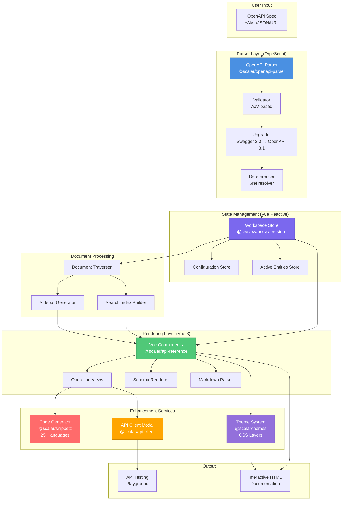

# System Overview: Interactive API Documentation Generation

**Use Case:** Generate Interactive API Documentation from OpenAPI Specifications

## 1. System Overview Diagram

## 2. Component Catalog

| Component Name | Technology/Framework | Primary Responsibility | Key Files | Heavy Logic |
|----------------|---------------------|------------------------|-----------|-------------|
| **OpenAPI Parser** | TypeScript, AJV | Parse, validate, upgrade, and dereference OpenAPI documents | `packages/openapi-parser/src/utils/validate.ts` `packages/openapi-parser/src/utils/dereference.ts` `packages/openapi-parser/src/lib/Validator/Validator.ts` | - Validates OpenAPI 2.0/3.0/3.1 against schemas - Recursively resolves $ref pointers (internal & external) - Upgrades Swagger 2.0 to OpenAPI 3.1 - Handles circular references - Filesystem abstraction for multi-file specs |
| **Workspace Store** | Vue 3 Reactive, TypeScript | Manage OpenAPI documents, metadata, and application state | `packages/workspace-store/src/client.ts` `packages/workspace-store/src/server.ts` | - Client/server dual-mode store - Document chunking for large specs - Lazy loading of components/operations - Reference resolution on-demand - SSR and static export modes |
| **Document Traverser** | TypeScript | Generate navigation structure and search index from OpenAPI spec | `packages/api-reference/src/features/traverse-schema/helpers/traverse-document.ts` `packages/api-reference/src/features/traverse-schema/helpers/traverse-paths.ts` | - Walks OpenAPI document tree - Groups operations by tags - Generates sidebar hierarchy - Extracts webhooks and models - Custom sorting (tags/operations) - Builds search index data |
| **API Reference Components** | Vue 3, TypeScript | Render interactive API documentation UI | `packages/api-reference/src/components/ApiReference.vue` `packages/api-reference/src/features/Operation/Operation.vue` `packages/api-reference/src/components/Content/Schema/` | - Reactive rendering of OpenAPI elements - Operation detail views (params, body, responses) - Schema visualization (objects, arrays, enums) - Example request/response display - Mobile and desktop layouts - Intersection observer for scrolling |
| **Code Snippets Generator** | TypeScript, Plugin Architecture | Generate HTTP request code examples in multiple languages | `packages/snippetz/src/snippetz.ts` `packages/snippetz/src/plugins/` | - HAR (HTTP Archive) to code conversion - 25+ language/library targets - Handles auth, headers, query params, body - Multipart/form data support - Tree-shakeable plugin system |
| **API Client Modal** | Vue 3, TypeScript | Embedded API testing playground within documentation | `packages/api-reference/src/features/api-client-modal/ApiClientModal.vue` `packages/api-reference/src/features/api-client-modal/useApiClient.ts` | - Live API request execution - Request/response inspection - Authentication management - Environment/variable substitution - Syncs with operation examples - Collection management |
| **Theme System** | CSS Custom Properties, CSS Layers | Customizable visual styling for documentation | `packages/themes/src/presets/` `packages/themes/src/base/variables.css` `packages/themes/src/index.ts` | - CSS Layer-based theming (scalar-base, scalar-theme) - 12+ built-in themes - Dark/light mode support - Tailwind integration - Scoped resets (scalar-app class) - Dynamic theme injection |
| **Markdown Parser** | TypeScript, Custom Parser | Render markdown in descriptions with syntax highlighting | `packages/api-reference/src/libs/markdown.ts` | - Markdown to HTML conversion - Code syntax highlighting - Sanitization for security - Link processing |
| **HTTP Client Store** | Vue 3 Reactive | Manage HTTP client selection state | `packages/api-reference/src/stores/useHttpClientStore.ts` | - Track selected code snippet language - Client preferences persistence - Featured clients logic |

## 3. Technology Stack

### UI Layer
- **Framework:** Vue 3 (Composition API)
- **Styling:** CSS Custom Properties, CSS Layers
- **Layout:** Flexbox, Grid, Intersection Observer API
- **State:** Vue Reactive System (ref, reactive, computed)

### State/Logic Layer
- **State Management:** Custom Vue Reactive Stores (Workspace Store, Active Entities)
- **Validation:** AJV (JSON Schema validator)
- **Reference Resolution:** Custom recursive resolver with WeakSet cycle detection
- **Document Processing:** Tree traversal algorithms

### Service/API Layer
- **Parser:** TypeScript-based OpenAPI parser
- **Code Generation:** Plugin-based code snippet generation
- **HTTP:** Fetch API (optional proxy support)
- **File System:** Node.js fs module (server-side)

### Data Layer
- **Storage:** In-memory reactive stores
- **Document Format:** OpenAPI 3.1/3.0, Swagger 2.0 (upgraded)
- **Data Exchange:** JSON, YAML
- **Reference Format:** JSON Pointer ($ref)

### External Dependencies
- **CDN Delivery:** jsDelivr, npm registry
- **Optional Proxy:** `proxy.scalar.com` for CORS
- **Validation Schemas:** Official OpenAPI schemas (2.0, 3.0, 3.1)

## 4. Integration Points

### OpenAPI Parser ↔ Workspace Store
- **Protocol:** Direct function calls (TypeScript modules)
- **Data Format:** OpenAPI.Document (JavaScript object)
- **Mode:** Sync (after async parsing/dereferencing)
- **Flow:** Parser outputs dereferenced document → Workspace ingests and makes reactive

### Workspace Store ↔ Vue Components
- **Protocol:** Vue Reactivity System
- **Data Format:** Reactive refs and reactive objects
- **Mode:** Reactive (automatic updates on change)
- **Flow:** Components watch store properties → Auto re-render on updates

### Document Traverser ↔ Sidebar/Search
- **Protocol:** Direct function calls
- **Data Format:** TraversedEntry[] (custom navigation structure)
- **Mode:** Sync
- **Flow:** Traverser walks OpenAPI doc → Outputs navigation tree → Components render

### API Reference ↔ Code Generator
- **Protocol:** Direct function calls
- **Data Format:** HarRequest (HTTP Archive format)
- **Mode:** Sync
- **Flow:** Operation data → Converted to HAR → Snippetz generates code → Displayed

### API Reference ↔ API Client Modal
- **Protocol:** Vue component composition + shared store
- **Data Format:** Shared Workspace Store
- **Mode:** Reactive
- **Flow:** User clicks "Test Request" → Modal opens → Shares operation data → Executes request

### Theme System ↔ Components
- **Protocol:** CSS Custom Properties + CSS Layers
- **Data Format:** CSS variables (e.g., `--scalar-color-1`)
- **Mode:** Declarative
- **Flow:** Theme CSS loaded → Variables applied → Components styled automatically

### Browser ↔ Standalone Script
- **Protocol:** Global JavaScript object (`window.Scalar`)
- **Data Format:** Configuration object
- **Mode:** Imperative (createApiReference())
- **Flow:** Script tag loads → exposes global API → User calls with config → Mounts app

## 5. Where to Start

### To understand user interactions:
- **Lifecycle:** Start with `packages/api-reference/src/standalone.ts` - the entry point for CDN usage
- **Flow:** Look at `packages/api-reference/src/components/ApiReference.vue` - the main component
- **Key Hook:** `packages/api-reference/src/features/document-source/hooks/useDocumentSource.ts` - orchestrates the entire document loading pipeline

### To understand data flow:
- **Start:** `packages/openapi-parser/src/utils/validate.ts` - OpenAPI spec enters here
- **Transform:** `packages/openapi-parser/src/utils/dereference.ts` - references get resolved
- **Store:** `packages/workspace-store/src/client.ts` - data becomes reactive
- **Process:** `packages/api-reference/src/features/traverse-schema/helpers/traverse-document.ts` - structure extracted
- **Display:** `packages/api-reference/src/components/Content/Content.vue` - UI renders

### To understand business logic:
- **Document Processing:** `packages/api-reference/src/features/traverse-schema/` - navigation and indexing logic
- **Rendering Logic:** `packages/api-reference/src/features/Operation/Operation.vue` - how operations are displayed
- **Code Generation:** `packages/snippetz/src/plugins/` - language-specific snippet generation
- **State Management:** `packages/workspace-store/src/client.ts` - how documents and settings are managed

### To understand integration scenarios:
- **CDN Usage:** `packages/api-reference/index.html` - simplest integration
- **React:** `packages/api-reference-react/src/ApiReference.tsx` - React wrapper
- **Express:** `integrations/express/` - backend framework integration
- **Next.js:** `integrations/nextjs/` - full-stack framework integration

## 6. Key Architectural Decisions

### Why Dual-Mode Workspace Store?
The Workspace Store has both client-side and server-side implementations to support:
1. **Large Documents:** Server-side chunking prevents browser memory issues
2. **SSR:** Server-side rendering for faster initial page loads
3. **Static Export:** Generate static sites with lazy-loaded chunks
4. **Edge Deployment:** Works in various serverless environments

### Why Custom Parser vs. Existing Libraries?
The `@scalar/openapi-parser` was built instead of using `swagger-parser` because:
1. **Modern TypeScript:** Full type safety and modern async/await patterns
2. **Performance:** Optimized for browser and Node.js with minimal dependencies
3. **Control:** Custom error handling and plugin system for extensibility
4. **Bundle Size:** Tree-shakeable, smaller footprint for browser usage

### Why Vue 3 for Components?
Vue 3 was chosen for the rendering layer because:
1. **Reactivity:** Built-in reactive system perfect for dynamic API docs
2. **Performance:** Virtual DOM with Composition API for efficient updates
3. **Bundle Size:** Smaller than React for embedding scenarios
4. **SSR Support:** Built-in server-side rendering capabilities

### Why Plugin-Based Code Generation?
Snippetz uses a plugin architecture because:
1. **Tree-Shaking:** Users only bundle the languages they need
2. **Extensibility:** Easy to add new languages/libraries
3. **Consistency:** Shared utilities across plugins (objectToString, etc.)
4. **Maintenance:** Each plugin is isolated and testable

## 7. Data Flow Example

### Complete Flow: OpenAPI URL → Interactive Documentation

1. **Input:** User provides OpenAPI spec URL via `createApiReference()`
2. **Fetch:** `useDocumentFetcher` downloads the spec (with optional proxy)
3. **Normalize:** `normalize()` converts string to object (JSON/YAML detection)
4. **Validate:** `Validator` checks against OpenAPI schema using AJV
5. **Upgrade:** If Swagger 2.0 or OpenAPI 3.0, upgrade to 3.1
6. **Dereference:** Resolve all `$ref` pointers (internal and external)
7. **Store:** Workspace Store makes document reactive
8. **Traverse:** Walk document to generate navigation structure
9. **Render:** Vue components display operations, schemas, examples
10. **Enhance:** Generate code snippets for each operation
11. **Test:** API Client Modal allows live request execution
12. **Style:** Theme system applies visual design

## 8. Performance Optimizations

### Lazy Loading
- Components use `IntersectionObserver` to render on-scroll
- Large documents chunk operations and schemas
- External references loaded on-demand

### Caching
- Dereferenced documents cached in memory
- Code snippets generated on-demand, not upfront
- Workspace Store uses WeakMap for efficient lookups

### Bundle Optimization
- Tree-shakeable exports (ESM)
- Separate builds for standalone and integrated use
- Minimal core, plugins loaded optionally

## 9. Error Handling

### Parser Errors
- Validation errors collected (doesn't throw immediately)
- Detailed error messages with JSON Pointer paths
- Fallback to empty spec if parsing fails

### Reference Resolution Errors
- Circular reference detection with WeakSet
- Missing reference warnings (doesn't break entire doc)
- External fetch errors logged, not thrown

### Rendering Errors
- Vue error boundaries prevent full crashes
- Invalid schema data renders fallback UI
- Console warnings for developer debugging

## 10. Testing Strategy

### Unit Tests
- Each parser utility has vitest tests
- Workspace Store operations tested in isolation
- Individual Vue components tested

### Integration Tests
- Full OpenAPI spec parsing pipeline
- Workspace Store with real documents
- Component rendering with mock data

### Benchmark Tests
- Parser performance against swagger-parser
- Large document rendering performance
- Code generation speed across languages

## 11. Deployment Modes

### CDN (Standalone)
- Single `<script>` tag inclusion
- Global `Scalar` object exposed
- Self-contained bundle with all dependencies

### NPM Package (Integrated)
- Framework-specific wrappers (React, Vue, etc.)
- Tree-shakeable imports
- Shares dependencies with host app

### Backend Integration
- Framework middleware (Express, Fastify, etc.)
- Auto-generates route handler
- Serves documentation at specific path (e.g., `/api/docs`)

### Static Site Generation
- Server-side workspace store generates chunks
- Static HTML + lazy-loaded JSON
- Deployable to any CDN or static host

## 12. Extensibility Points

### Custom Themes
- CSS variables override system
- CSS Layer insertion for custom styles
- JavaScript-based theme injection

### Custom Plugins
- Document source plugins (custom fetchers)
- Code snippet plugins (new languages)
- Custom components via slots

### Configuration
- 40+ configuration options
- Per-document and global settings
- Runtime updates supported

### Event System
- Document load events
- Operation selection events
- Request execution events

